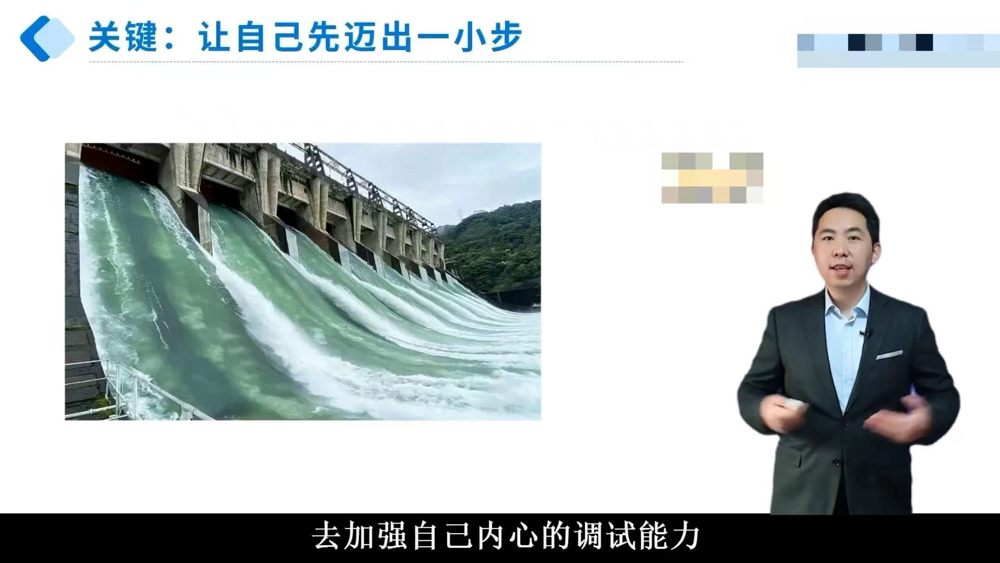

# 如何进入良性循环：克服拖延症的学习笔记

本节课程探讨了如何通过理解拖延的心理机制，采取有效策略进入工作与生活的良性循环。以下是主要内容的结构化总结。

## 一、拖延的心态与焦虑曲线
拖延往往源于对任务不确定性的恐惧，导致我们选择暂时逃避。然而，这种行为会引发焦虑，并随着拖延时间的增长而加速上升。  
- **毒舌曲线**：描述了拖延过程中焦虑的变化趋势。如果一直拖延，焦虑如同眼镜蛇昂首，最终变得难以控制。但一旦开始行动，哪怕只是迈出一小步，焦虑也会迅速下降。
- **红区与蓝区**：  
  - 红区：拖延阶段，焦虑持续上升。  
  - 蓝区：开始行动后，焦虑逐渐降低，进入高效工作状态。

  
*图1解释：水坝象征着拖延时积累的焦虑，而“迈出一小步”则是打开闸门的关键，让焦虑如洪水般倾泻，从而缓解心理压力。*

## 二、拖延的恶性循环及其破解
拖延行为具有自我强化的特点，容易形成恶性循环：  
1. 拖延 → 焦虑增加 → 自我否定 → 动力消耗 → 更加拖延。  
2. 解决方法：将拖延转化为良性循环，通过实际行动增强自信和成就感。  

心理学研究表明，以下四点阻碍我们进入良性循环：  
- **缺乏自信**：目标设定过高或不确定性较强，使人不敢启动。  
- **任务不愉快**：预期过程或结果令人反感，降低行动意愿。  
- **目标遥远**：缺乏即时反馈，难以维持动力。  
- **无法专注**：分心问题严重，影响效率。

## 三、两个实用心法
为了打破拖延的恶性循环，课程介绍了两种简单有效的方法：

### 1. 五分钟启动法  
由Instagram创始人凯文·斯特罗姆提出，核心理念是告诉自己“先做五分钟”。这种方法利用了人类行为的惯性：一旦开始，继续下去的概率会显著提高。即使最初只想做五分钟，通常也能顺利完成整个任务。  

### 2. 想象未来的自己  
拖延者常对未来抱有过度乐观的期待，认为“未来的自己”可以轻松解决当前的问题。但实际上，这只会加重未来的负担。因此，我们需要重新审视对未来的期望，善待未来的自己，避免把困难推给未来的版本。

## 四、案例实践与行动计划
在课程最后，建议学员挑选一件曾经拖延的任务，尝试使用“五分钟启动法”进行实践。具体步骤如下：  
1. 选择一个具体的任务（如写报告、学习新技能等）。  
2. 设定五分钟的时间限制，专注于完成该任务的第一小部分。  
3. 观察自己的心理变化，记录体验。

## 总结
本节课的核心内容包括：  
1. **理解拖延的机制**：从焦虑曲线到红区与蓝区的划分，揭示拖延背后的心理动因。  
2. **识别阻碍因素**：明确四大障碍（缺乏自信、任务不愉快、目标遥远、无法专注）对良性循环的影响。  
3. **掌握应对策略**：通过“五分钟启动法”和“想象未来的自己”，逐步培养行动习惯，进入良性循环。  

希望这些知识能帮助你更好地管理时间，摆脱拖延的困扰！